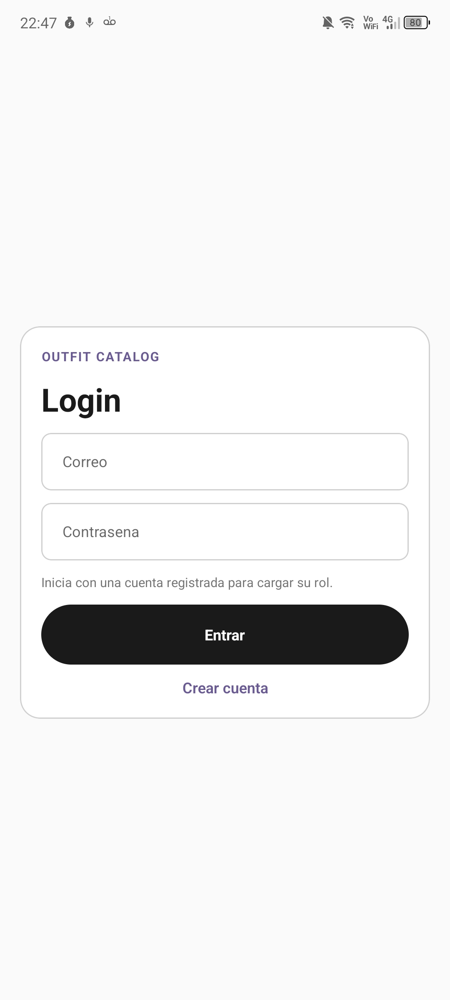
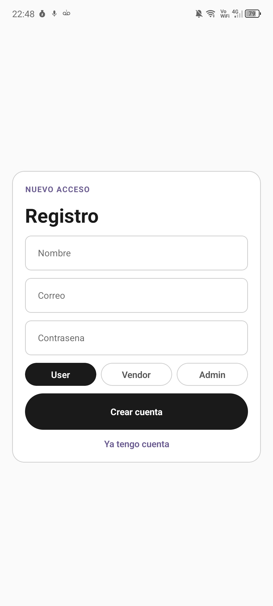
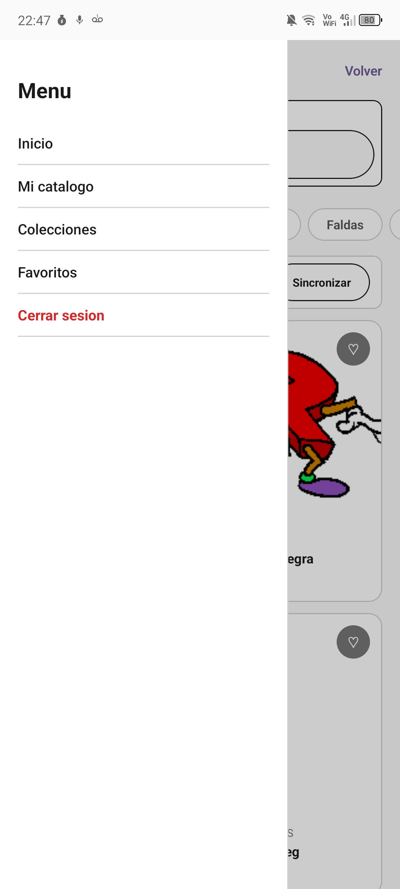
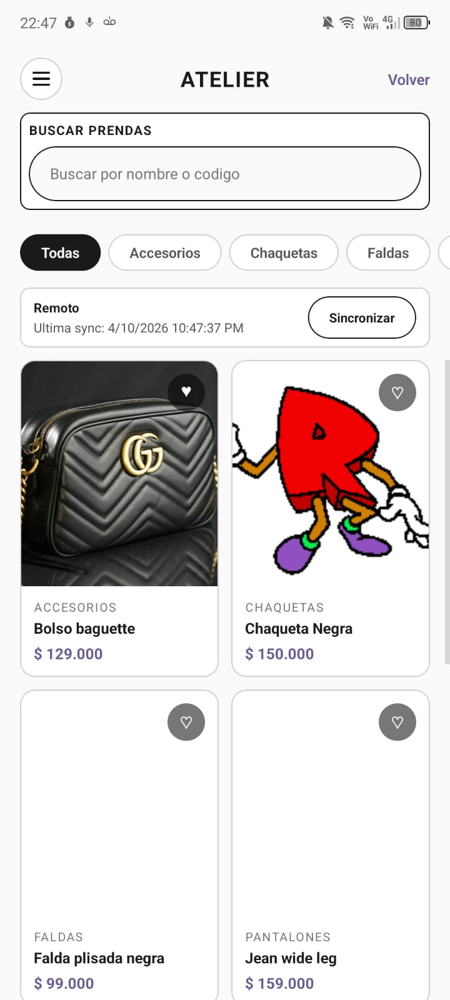
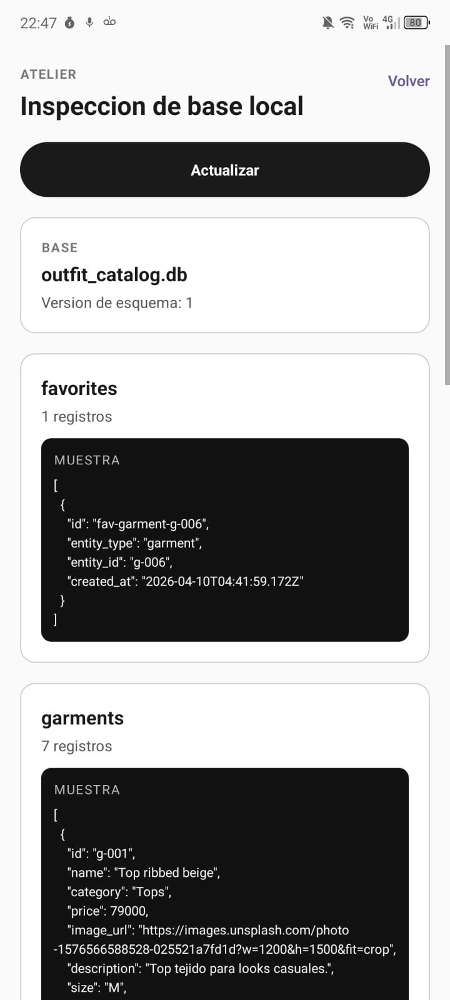
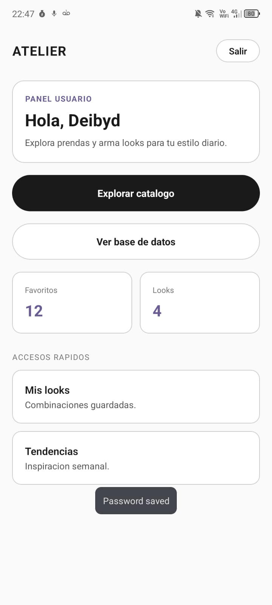
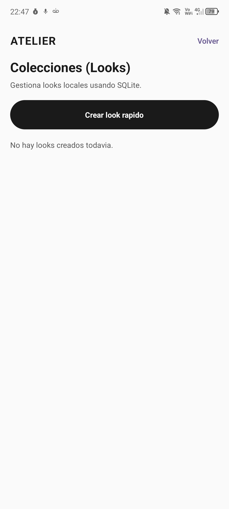
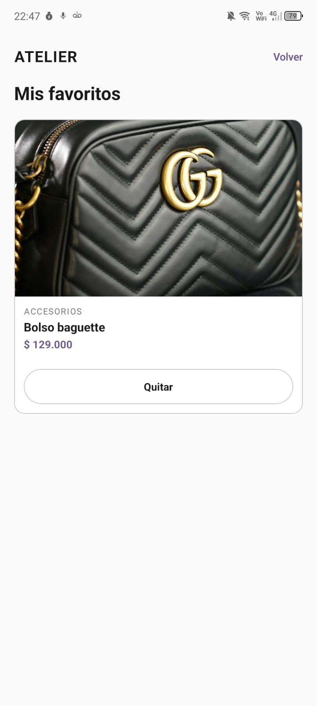

# 📱 OUTFIT CATALOG - Resumen Ejecutivo

## 1️⃣ ¿QUÉ ES OUTFIT CATALOG?

Aplicación mobile para **gestionar prendas de vestir y crear looks (combinaciones de ropa)**.

- 📊 Catálogo de prendas searchable
- ⭐ Sistema de favoritos
- 👗 Crear y guardar looks
- 💬 Compartir por WhatsApp
- 👥 Roles (usuario, vendedor, admin)
- 📱 Funciona offline (persistencia local)

---

## 2️⃣ REQUISITOS DEL PROFESOR

### ✅ GitHub con Ramas Estructuradas

```
master ← (Release) ← staging ← (QA) ← qa (Development)
                                         └── feature/SCRUM-XX
```

**3 Ramas Principales:**
- 🟢 **master**: Producción estable
- 🔵 **staging**: Pruebas QA
- 🟡 **qa**: Desarrollo (rama base)

**Branching Strategy:** GitFlow
- Feature branches para cada historia
- PRs con reviews antes de merge
- Tests automáticos en CI

---

### ✅ Jira con Historias de Usuario

```
PROYECTO: OUTFIT CATALOG

SPRINT 1: Base y Catálogo (14 mar - 28 mar)
├── SCRUM-11: Galería de prendas por categoría ✓
├── SCRUM-14: Arquitectura MVVM ✓
├── SCRUM-15: Base de datos SQLite ✓
├── SCRUM-16: Integración Firestore
├── SCRUM-13: Búsqueda en tiempo real
└── SCRUM-82: Autenticación por rol

SPRINT 2: Looks y Favoritos
├── SCRUM-17: Crear looks
├── SCRUM-18: Editar/Eliminar looks
├── SCRUM-19: Pantalla de looks
├── SCRUM-20: Favoritos
├── SCRUM-21: Offline favoritos
└── SCRUM-22: Caché de imágenes

SPRINT 3: WhatsApp y Entrega
├── SCRUM-23: Compartir por WhatsApp
├── SCRUM-24: Personalizar mensaje
├── SCRUM-25: Compartir prenda
├── SCRUM-26: Filtros avanzados
├── SCRUM-27: Onboarding
├── SCRUM-28: Trazabilidad GitOps
└── SCRUM-29: Tests y CI/CD
```

---

### ✅ Sub-actividades por Historia

**Ejemplo: SCRUM-11 (Galería de Prendas)**

```
┌─────────────────────────────────────┐
│  SCRUM-11: Galería por Categoría    │
├─────────────────────────────────────┤
│  ✓ Diseñar modelo de datos          │
│  ✓ Crear ViewModel                  │
│  ✓ Implementar UI ReactNative       │
│  ✓ Tests unitarios (80%)            │
│  ✓ Integración con BD local         │
│  □ Integración con Firestore        │
│  □ Performance testing              │
└─────────────────────────────────────┘
```

**Patrón Usado:**
1. Domain (modelo de negocio)
2. Data (persistencia)
3. Presentation (UI)
4. Tests para cada capa

---

### ✅ Primer Bosquejo de la App

#### Pantallas Implementadas

```
┌──────────────────────┐
│   🔐 LOGIN SCREEN    │
│                      │
│  • Firebase Auth     │
│  • Selección rol     │
│  • Email + Password  │
└──────────────────┬───┘
                   │
        ┌──────────┼──────────┐
        ↓          ↓          ↓
    ┌────┴──┐ ┌───┴──┐ ┌─────┴───┐
    │ USER  │ │VENDOR│ │ ADMIN   │
    └────┬──┘ └──────┘ └─────────┘
         │
    ┌────┴──────────────────────┐
    ↓                            ↓
┌──────────────┐     ┌────────────────┐
│ 👗 GALLERY   │────→│ 📋 DETAIL      │
│              │     │                │
│ • Grid 2col  │     │ • Imagen       │
│ • Filtros    │     │ • Descripción  │
│ • Search     │     │ • Precio (COP) │
│ • Favoritos  │     │ • ❤️ Favorito  │
│              │     │ • ➕ Agregar a │
│              │     │   Look         │
└──────────────┘     └────────────────┘

    ┌──────────────┐     ┌────────────────┐
    │ ⭐ FAVORITES │────→│ 👜 LOOKS       │
    │              │     │                │
    │ • Galería    │     │ • Lista de     │
    │ • Offline OK │     │   looks guardados
    │              │     │ • Crear nuevo  │
    │              │     │ • 💬 Compartir │
    │              │     │   WhatsApp     │
    └──────────────┘     └────────────────┘
```

    ### Capturas reales del proyecto

















```
┌─────────────────────────────────┐
│  React Native 0.81              │
│  • Código único iOS + Android   │
└─────────────────────────────────┘
              ↑
┌─────────────────────────────────┐
│  Expo SDK 54                    │
│  • Desarrollo rápido sin build  │
│  • Testing con Expo Go (móvil)  │
└─────────────────────────────────┘
              ↑
┌──────────────────────────────────────┐
│  TypeScript + React Navigation       │
│  • Type safety                       │
│  • Navegación nativa                 │
└──────────────────────────────────────┘
              ↑
┌─────────────────────────────────┐
│  SQLite (expo-sqlite)           │
│  • Persistencia local           │
│  • Offline-first                │
└─────────────────────────────────┘
              ↑
┌─────────────────────────────────┐
│  Firebase / Firestore           │
│  • Backend serverless           │
│  • Sync remoto                  │
└─────────────────────────────────┘
```

---

## 3️⃣ ARQUITECTURA LIMPIA IMPLEMENTADA

```
                     ┌─────────────────┐
                     │ PRESENTATION    │
                     │                 │
                     │ • Screens       │
                     │ • ViewModels    │
                     │ • UI Components │
                     └────────┬────────┘
                              │ usan
                              ↓
                     ┌─────────────────┐
                     │  DOMAIN         │
                     │                 │
                     │ • Entities      │
                     │ • Use Cases     │
                     │ • Repositories  │
                     │   (contrato)    │
                     └────────┬────────┘
                              ↑
                              │ implementa
                     ┌─────────────────┐
                     │ DATA            │
                     │                 │
                     │ • Datasources   │
                     │ • Models        │
                     │ • Repository    │
                     │   (impl)        │
                     └─────────────────┘
```

### Ventajas de esta Arquitectura

✅ **Testeable**: Cada capa es independiente  
✅ **Escalable**: Agregar features es simpler  
✅ **Mantenible**: Cambios localizados  
✅ **Independiente de detalles**: Domain no toca BD/UI  
✅ **Inyección de dependencias**: Fácil mockear para tests  

### Ejemplo: Feature Garment

```
Feature Garment
├── Domain/
│   ├── Garment (entidad)
│   ├── GarmentRepository (contrato)
│   └── GetGarmentsUseCase
├── Data/
│   ├── GarmentLocalDataSource
│   ├── GarmentRemoteDataSource
│   └── GarmentRepositoryImpl (implementa el contrato)
└── Presentation/
    ├── GarmentGalleryScreen
    └── useGarmentGalleryViewModel
```

---

## 4️⃣ ESTADO ACTUAL

### ✅ Completado

- ✓ Estructura base Expo + TypeScript
- ✓ Clean Architecture setup
- ✓ Firebase Authentication
- ✓ SQLite local (expo-sqlite)
- ✓ Database schema + Migraciones
- ✓ Feature Garment (Domain + Data + básico UI)
- ✓ Tests unitarios para DAOs
- ✓ Sistema de roles (user/vendor/admin)
- ✓ Inyección de dependencias

### 🚧 En Progreso (esta semana)

- 🔄 Galería UI completa
- 🔄 Sincronización Firestore
- 🔄 Búsqueda / Filtros
- 🔄 Más tests (cobertura al 70%)

### ⏳ Próxima Semana

- ⏳ Feature Looks
- ⏳ Feature Favoritos
- ⏳ Integración WhatsApp
- ⏳ CI/CD con GitHub Actions

---

## 5️⃣ CÓMO CLONAR Y PROBAR

### Clonar el Proyecto

```bash
# Desde GitHub
git clone https://github.com/[equipo]/outfit-catalog.git
cd outfit-catalog

# Instalar dependencias
npm install
```

### Ejecutar Localmente

```bash
# Iniciar servidor Expo
npm run start

# En terminal aparte (iOS)
npm run ios

# O Android
npm run android

# O en web
npm run web
```

### Credenciales de Prueba

```
Email: test@outfit.com
Password: Test123456
Rol: user
```

---

## 6️⃣ DOCUMENTACIÓN ENTREGABLE

Este documento contiene:

📄 **PRIMER_ADELANTO.md** (este archivo)
- Visión general completa
- Stack tecnológico
- Arquitectura detallada
- Estado del proyecto
- Plan de próximas semanas

📊 **En GitHub**
- Ramas: master, staging, qa
- README con instrucciones
- GitHub Projects para tracking
- Pull Requests con historias Jira

🔗 **En Jira**
- 20 historias de usuario organizadas
- Sub-tareas granulares
- Story points assigned
- Sprints planificados

🎬 **Demo Vivo**
- App ejecutándose en dispositivo/emulador
- Navegar a través de pantallas
- Ver datos en BD local

---

## 7️⃣ INDICADORES CLAVE (KPIs)

| Métrica | Target | Estado |
|---------|--------|--------|
| Historias Implementadas | 20 | 6 ✓ |
| Cobertura Tests | 70% | 45% |
| Pantallas Funcionales | 8 | 4 ✓ |
| Branches Activas | 3 | 3 ✓ |
| Tickets Cerrados | 20 | 6 ✓ |

---

## 8️⃣ CONCLUSIÓN

**Outfit Catalog** es un proyecto profesional que demuestra:

✅ Buenas prácticas de ingeniería (Clean Architecture)  
✅ Control de versiones profesional (GitFlow)  
✅ Gestión ágil (Jira con historias y subtareas)  
✅ Testing y CI/CD desde el inicio  
✅ Documentación completa  
✅ Stack moderno y escalable  

**Estamos en camino a una aplicación lista para producción.** 🚀

---


