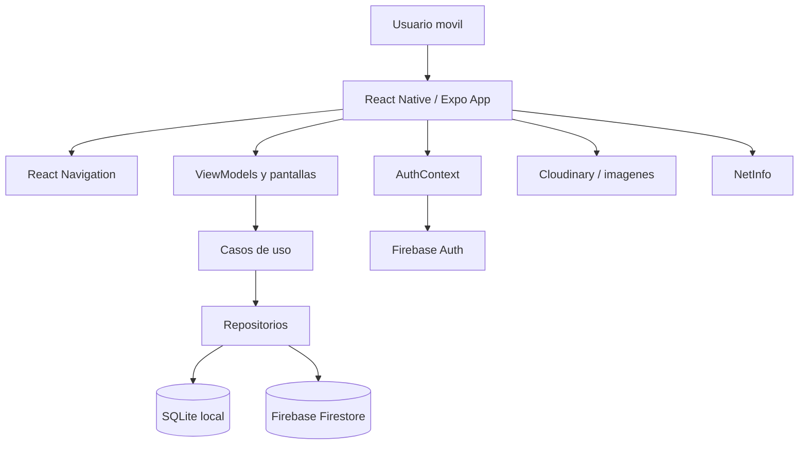
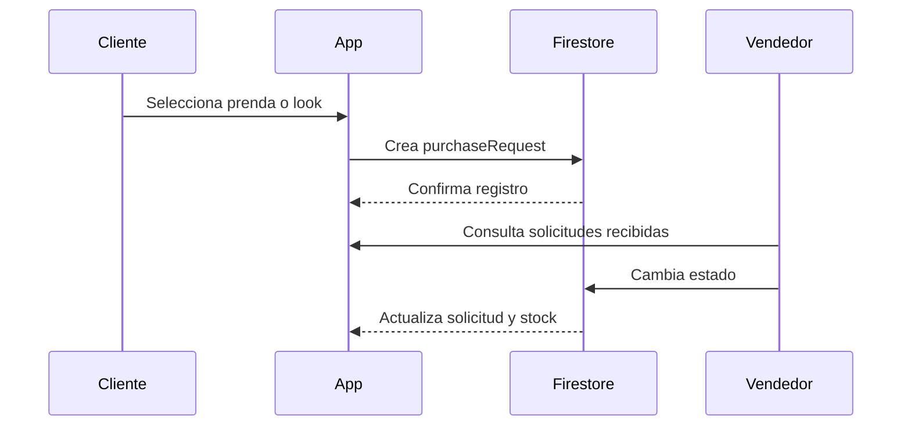

# Documentacion Tecnica y Arquitectura

## 1. Descripcion general

OutfitCatalog es una aplicacion movil construida con React Native, Expo y TypeScript. Su arquitectura combina pantallas por rol, servicios de dominio, persistencia local SQLite, sincronizacion con Firebase y consumo de servicios externos para imagenes y autenticacion.

## 2. Stack tecnologico

| Capa | Tecnologia |
|---|---|
| Aplicacion movil | React Native 0.81.5 |
| Framework | Expo SDK 54 |
| Lenguaje | TypeScript 5.9 |
| Navegacion | React Navigation |
| Persistencia local | expo-sqlite |
| Estado simple persistente | AsyncStorage |
| Autenticacion | Firebase Auth |
| Base remota | Cloud Firestore |
| Imagenes | Cloudinary, expo-image |
| Conectividad | NetInfo |
| Build | EAS Build |
| Tests | Vitest |

## 3. Arquitectura logica



## 4. Estructura de carpetas

```text
src/
  auth/
  components/
  context/
  core/
    database/
    di/
    services/
  features/
    garment/
    look/
    tryon/
  hooks/
  screens/
  theme.ts
  types.ts
```

## 5. Capas principales

### Presentacion

Incluye pantallas, componentes visuales y navegacion:

- `LoginScreen`
- `RegisterScreen`
- `GarmentGalleryScreen`
- `GarmentDetailScreen`
- `FavoritesScreen`
- `LooksScreen`
- `LookDetailScreen`
- `InventoryManagementScreen`
- `PurchaseRequestsScreen`
- `RoleHomeScreens`

### Dominio y servicios

Incluye casos de uso, repositorios y servicios de negocio:

- Repositorio de prendas.
- Servicios de solicitudes de compra.
- Servicios de mensajes de WhatsApp.
- Servicios de subida a Cloudinary.
- Servicios de autenticacion Firebase.

### Datos

Incluye:

- DAOs SQLite.
- Datasources locales y remotos.
- Conversores de modelo.
- Sincronizacion con Firestore.

## 6. Persistencia local

La app usa SQLite mediante `expo-sqlite`. Las tablas principales son:

| Tabla | Proposito |
|---|---|
| `garments` | Prendas/productos |
| `looks` | Looks creados por usuarios |
| `look_items` | Relacion entre looks y prendas |
| `favorites` | Favoritos de usuarios |
| `schema_meta` | Version de esquema y metadatos |

SQLite permite que la app cargue datos aun si la red falla, reduciendo dependencia de Firestore en cada apertura.

## 7. Persistencia remota

Firestore se usa para:

| Coleccion | Proposito |
|---|---|
| `users` | Perfiles, roles y telefonos |
| `garments` | Catalogo e inventario remoto |
| `looks` | Sincronizacion de looks |
| `purchaseRequests` | Solicitudes de compra |
| `analyticsEvents` | Eventos KPI de uso, conversion e inventario |

La app usa consultas filtradas para reducir carga:

- Catalogo: prendas `published == true`.
- Inventario: prendas por `vendorId`.
- Solicitudes: por `buyerId` o `vendorId`.

## 8. Autenticacion y roles

La autenticacion se gestiona con Firebase Auth:

- Correo y contrasena.
- Google Sign-In.

Los roles se guardan en Firestore:

| Rol | Acceso |
|---|---|
| `user` | Catalogo, favoritos, looks y solicitudes propias |
| `vendor` | Inventario, productos y solicitudes recibidas |
| `admin` | Reportes, usuarios y moderacion |

## 9. Flujo de solicitudes de compra



Estados:

- `pending`
- `contacted`
- `reserved`
- `sold`
- `cancelled`

Cuando una solicitud pasa a `reserved` o `sold`, el sistema descuenta stock. Si una reserva se revierte, restaura stock segun corresponda.

## 10. Estrategia offline

La app usa:

- SQLite para cache local.
- AsyncStorage para datos simples.
- NetInfo para detectar conectividad.
- Banner offline para informar al usuario.
- Fallback local en catalogo y solicitudes cuando Firestore no responde.

## 11. Analitica KPI

La aplicacion incluye una capa de analitica gratuita basada en Firestore. El servicio `analyticsService` registra eventos de autenticacion, catalogo, favoritos, looks, solicitudes e inventario en la coleccion `analyticsEvents`.

El panel `AdminReportsScreen` consulta esos eventos y calcula KPIs de los ultimos 30 dias, incluyendo usuarios activos medidos, registros, logins, vistas de catalogo, favoritos, looks creados, solicitudes creadas y solicitudes vendidas.

## 12. Despliegue

El build Android se genera con:

```bash
npx eas-cli@latest build -p android --profile preview --non-interactive
```

El perfil `preview` en `eas.json` genera APK:

```json
{
  "build": {
    "preview": {
      "android": {
        "buildType": "apk"
      }
    }
  }
}
```

## 13. Evidencia final

| Elemento | Valor |
|---|---|
| Commit | `5bd8d25` |
| Build ID | `b56095a2-87a4-4dac-ae47-7f5d8599dee4` |
| APK | `https://expo.dev/artifacts/eas/op3jk14owqSZtyJV5J7rBA.apk` |
| Estado | `FINISHED` |

## 14. Mantenibilidad

Fortalezas:

- TypeScript reduce errores de tipo.
- Separacion por modulos y servicios.
- Persistencia versionada con migraciones.
- Pruebas automatizadas para DAOs y servicios.
- Build reproducible con EAS.

Recomendaciones:

- Ampliar cobertura de pruebas en pantallas y flujos de autenticacion.
- Integrar Crashlytics.
- Complementar la analitica propia con Firebase Analytics nativo si se publica en tiendas.
- Documentar reglas Firestore en un archivo versionado.
- Crear pipeline CI para build y test en cada push.
